# Organizagro

Organizagro é um aplicativo desenvolvido pelo 
estudante Luidson Lima Santos como projeto para a 
disciplina Atividade Extensionista II do curso de 
Análise e Desenvolvimento de Sistemas do Centro 
Universitário Uninter.

O objetivo deste app é ser uma ferramenta intuitiva 
e funcional que auxilia pequenos agricultores a se 
planejarem, visando melhorar sua eficiência 
produtiva.

# Tecnologia utilizada: Flutter

## Dependências utilizadas:

* cupertino_icons: ^1.0.2
* sqflite: ^2.3.0
* http: ^1.1.0
* path: ^1.8.3
* intl: ^0.19.0
* geolocator: ^10.1.0
* url_launcher: ^6.2.3

## Api usada:
* Open Weather
	* É necessário criar o arquivo lib/constants/api_key.dart a partir do 
exemplo para configurar a chave da API

## Cursos que serviram de base:
* [CRUD em Flutter 2023 - Cadastro de Usuário (iniciante)](https://www.youtube.com/playlist?list=PLON4pEkDkNcge2Bvpp3Gj-k7ed2YX8vKb)
* [Minimal Weather App • Flutter Tutorial](https://www.youtube.com/watch?v=yLtpMqvMgdY)
* [Expense App Project | Flutter | Sqflite | Provider ](https://www.youtube.com/watch?v=_jvOS8yU6rQ&t)

## Funcionalidades:

* ### Controle de estoque

	* Listagem e resumo das categorias
	* Criação de novas categorias
	* Exclusão de categorias e das operações relacionadas
	* Criação de operações
	* Exclusão de operações
	* Exibição de saldo final

* ### Controle financeiro

	* Adição de transações de entrada e saída
	* Exclusão de transações
	* Exibição do saldo final

* ### Previsão do tempo

	* Detecção da localização atual do dispositivo
	* Barra para pesquisa de cidades
	* Exibição do clima atual
	* Exibição da previsão do tempo

## Capturas de tela:
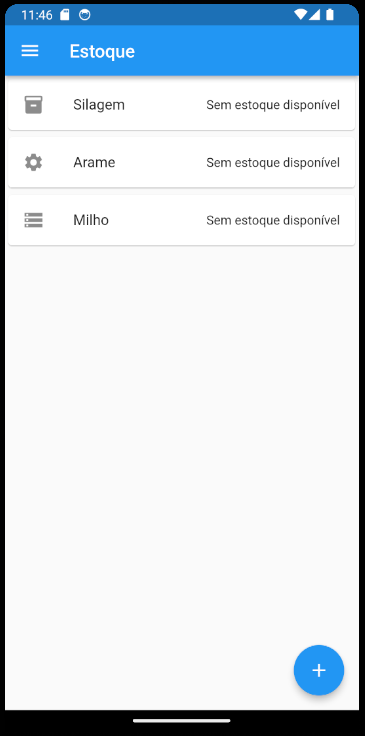
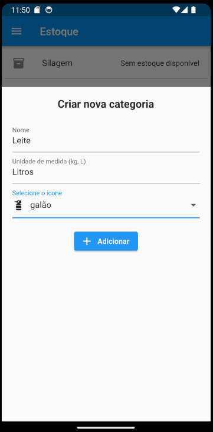
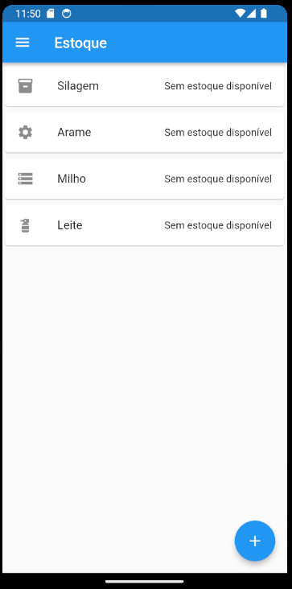
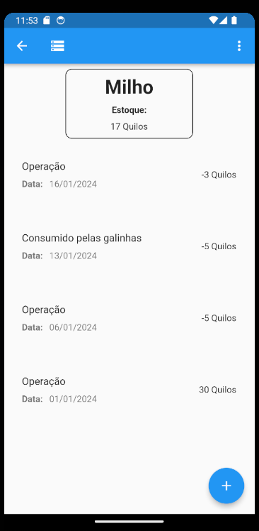
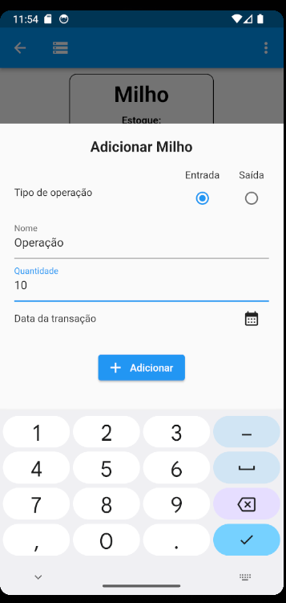
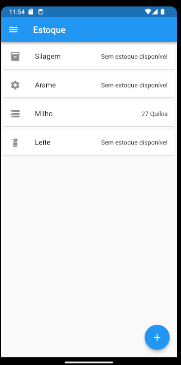
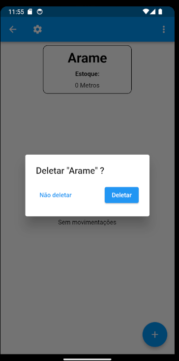

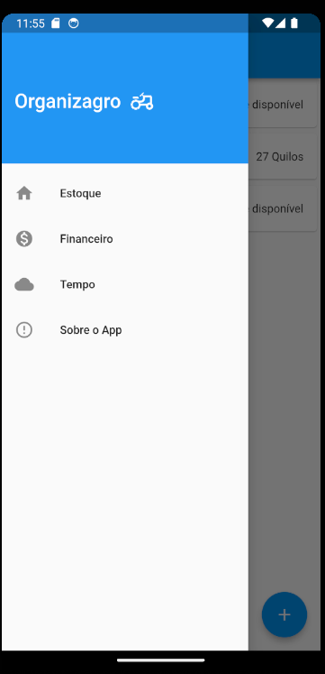
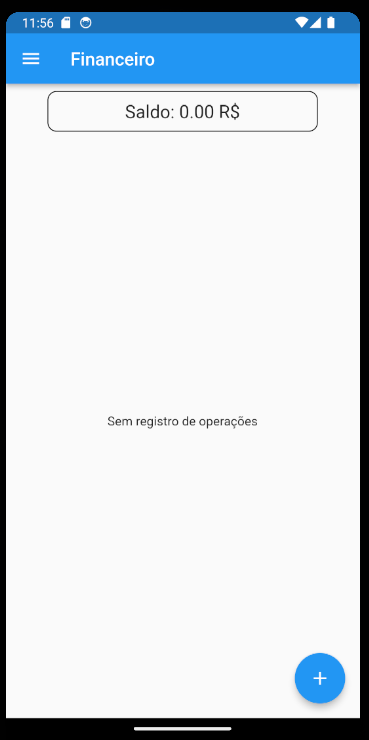
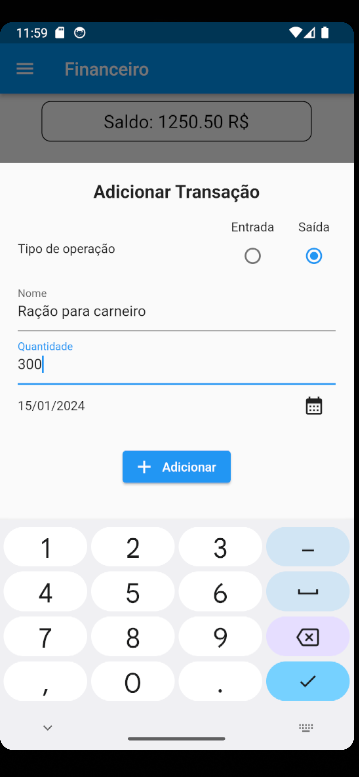
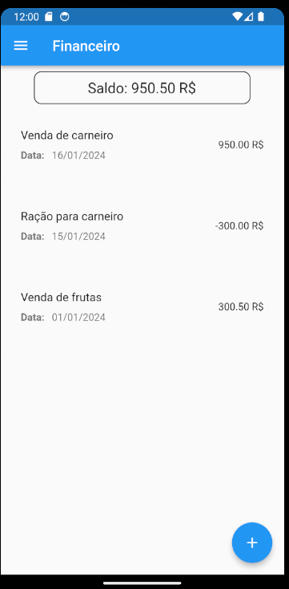
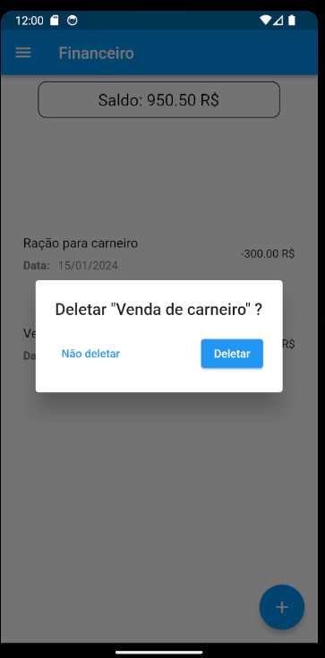
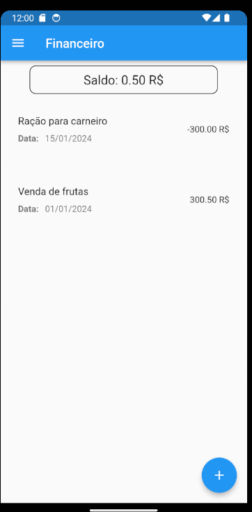
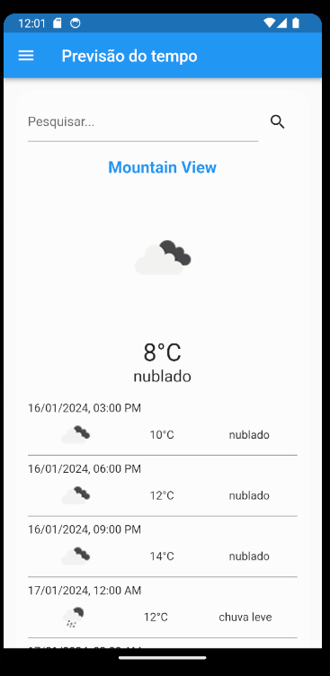

